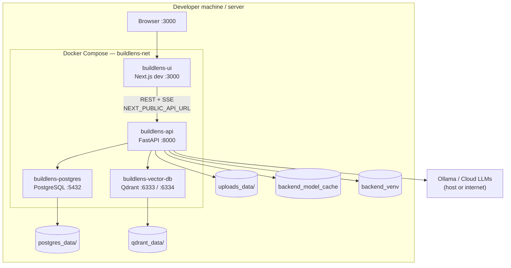
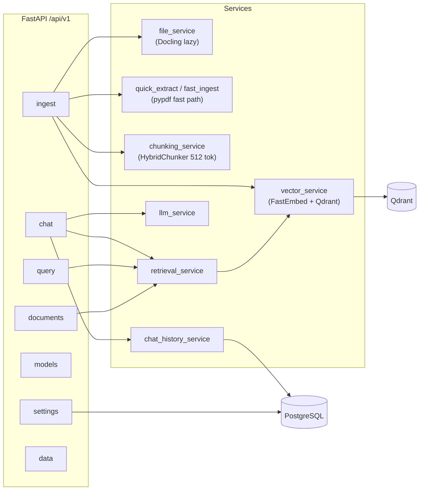
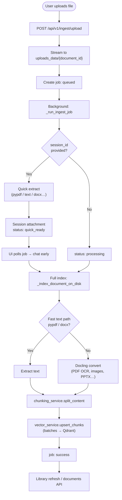
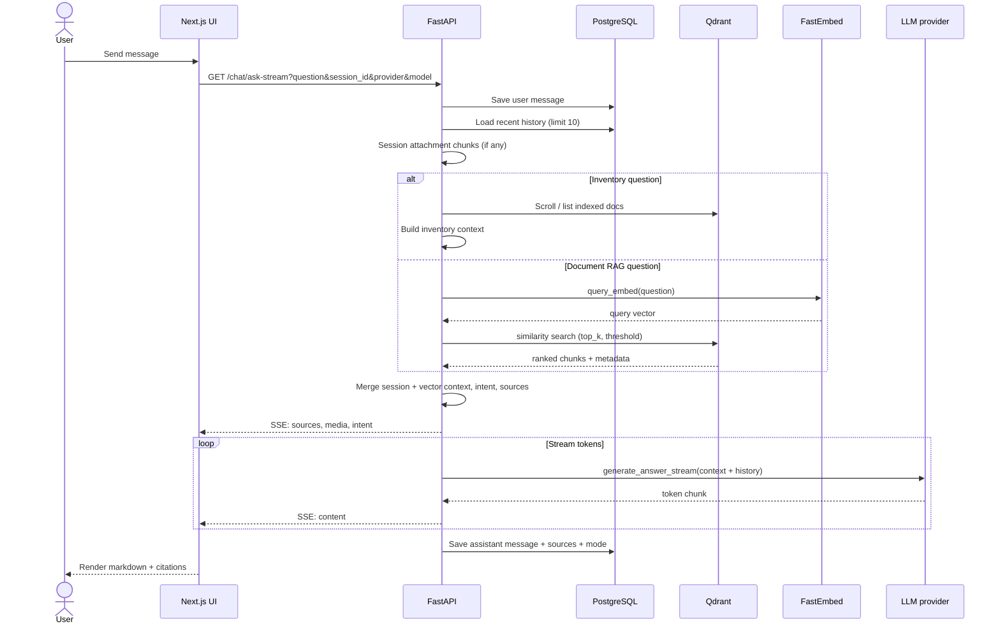

# BuildLens: Multimodal Self-Hosted RAG System

**BuildLens** is an open-source Retrieval-Augmented Generation (RAG) platform for multimodal documents. Index PDFs, spreadsheets, diagrams, images, and source files; query them through a chat interface backed by local or cloud language models, with vectors and chat data under your control.

## Key Features

- **Multimodal Document Processing**: Upload individual files or drag-and-drop entire folders from the **Library** or attach files in **Chat**. Supports PDF, DOCX, PPTX, images, CSV, XLSX, JSON, TXT, MD, PUML, and source code.
- **Fast + full indexing**: Text PDFs use a **pypdf fast path** (seconds); scanned PDFs and images fall back to **Docling**. Session uploads get a **quick preview** for immediate chat while full vector indexing runs in the background.
- **Self-Hosted Data Privacy**: Vector storage (Qdrant), chat history (PostgreSQL), and original uploads (`uploads_data/`) stay on your machine. Use **Ollama** for a fully local LLM path.
- **Cloud LLM Support**: OpenAI, Gemini, Anthropic, **OpenRouter**, and other providers. API keys are stored in PostgreSQL via the Settings UI.
- **Grounded answers**: Retrieval over Qdrant with cited sources, optional session attachments, and SSE streaming in the chat UI.

## System Architecture

Modular monorepo deployed with Docker Compose:

| Layer | Technology | Role |
| ----- | ---------- | ---- |
| **Frontend** | Next.js 16 (App Router), TypeScript, Zustand, shadcn/ui | Chat, Library, Settings; calls API via `lib/api.ts` (REST + SSE) |
| **Backend** | FastAPI, Python 3.14, `uv`, SQLModel | Ingest, chunk, embed, retrieve, LLM orchestration |
| **Vector DB** | Qdrant v1.17.0 | Chunk embeddings + metadata (cosine search) |
| **Database** | PostgreSQL 16 | Sessions, messages, app settings, session attachments |
| **Storage** | `uploads_data/` (bind mount) | Original files for preview/download |
| **Model cache** | Docker volume `backend_model_cache` | FastEmbed ONNX weights (persisted across API restarts) |

### Deployment diagram



### Backend service map



## Document Ingest Flow

Uploads are **async**: the API saves the file, returns a `job_id`, and processes in a background task (one ingest at a time via semaphore).



**Paths on disk**

| Path | Purpose |
| ---- | ------- |
| `uploads_data/` | Original uploaded bytes |
| `qdrant_data/` | Vector index |
| `postgres_data/` | Sessions, messages, settings |
| `backend_model_cache` (volume) | `nomic-ai/nomic-embed-text-v1.5` ONNX cache |

## Chat and RAG Sequence

Streaming uses **GET `/api/v1/chat/ask-stream`** (Server-Sent Events). The browser loads history via REST; each question triggers retrieve-then-generate on the server.



## Quick Start (Docker)

BuildLens is fully containerized. Ensure **Docker** and **Docker Compose** are installed.

1. **Clone the repository:**

   ```bash
   git clone https://github.com/tharitthaveekittikul/DocRAG
   cd DocRAG
   ```

2. **Setup environment variables:**

   ```bash
   cp .env.example .env
   ```

   Set `NEXT_PUBLIC_API_URL=http://localhost:8000/api/v1` for browser access when using Docker.

3. **Launch the stack:**

   ```bash
   docker compose up --build
   ```

4. **Access the application:**
   - **Frontend UI:** http://localhost:3000
   - **Library:** http://localhost:3000/library
   - **Backend API docs:** http://localhost:8000/docs
   - **Qdrant dashboard:** http://localhost:6333/dashboard

The API container is limited to **4 GB RAM / 2 CPUs** by default; embedding models load on first search/ingest and are cached in the `backend_model_cache` volume.

## Local Development

### Backend

1. `cd backend`
2. `uv sync`
3. Start Qdrant + Postgres: `docker compose up -d qdrant postgres`
4. Run:

   ```bash
   uv run uvicorn app.main:app --reload --port 8000
   ```

   Use `DB__HOST=localhost`, `QDRANT__HOST=localhost` in `.env` when not inside Docker.

### Frontend

1. `cd frontend`
2. `npm install`
3. `npm run dev`

## Supported Document Types

Default max upload size is **1 GB** (see Settings → Storage / `STORAGE__MAX_UPLOAD_BYTES`).

| Format | Processing |
| ------ | ---------- |
| **PDF** (text) | pypdf fast path → chunk → embed |
| **PDF** (scanned) / **images** / **DOCX** / **PPTX** | Docling (loaded on demand) |
| **CSV, XLSX** | pandas → text |
| **JSON, TXT, MD, PUML, source code** | Direct read + language-aware chunking |

Embeddings: **FastEmbed** with `nomic-ai/nomic-embed-text-v1.5` (768-dim). Chunking: **HybridChunker**, max **512 tokens** per chunk.

## Supported LLM Providers

Configure providers and API keys in **Settings**. Defaults can still come from `.env` (`LLM__PROVIDER`, `LLM__OLLAMA_BASE_URL`, etc.).

- **Ollama** (local, default in `.env.example`)
- **OpenAI**, **Gemini**, **Anthropic**
- **OpenRouter** and additional cloud routes used by the chat model picker

## Contributing

Contributions are welcome. Use conventional commits (`feat:`, `fix:`, `docs:`). Run `npm run lint` in `frontend` before opening PRs.
