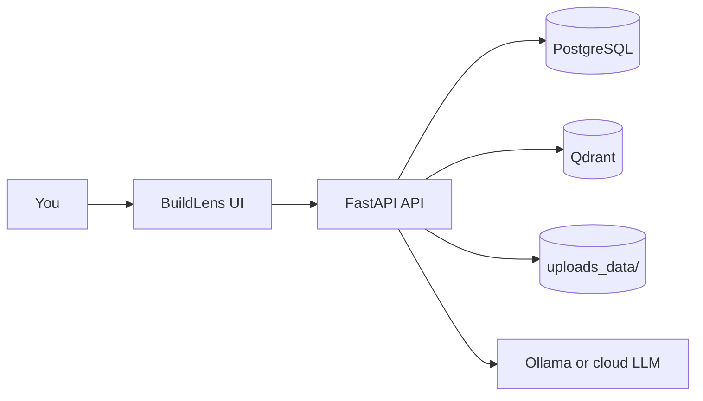
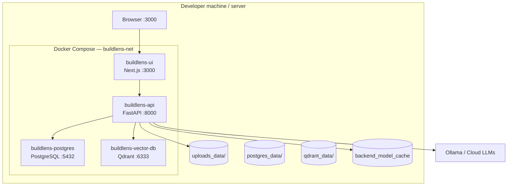
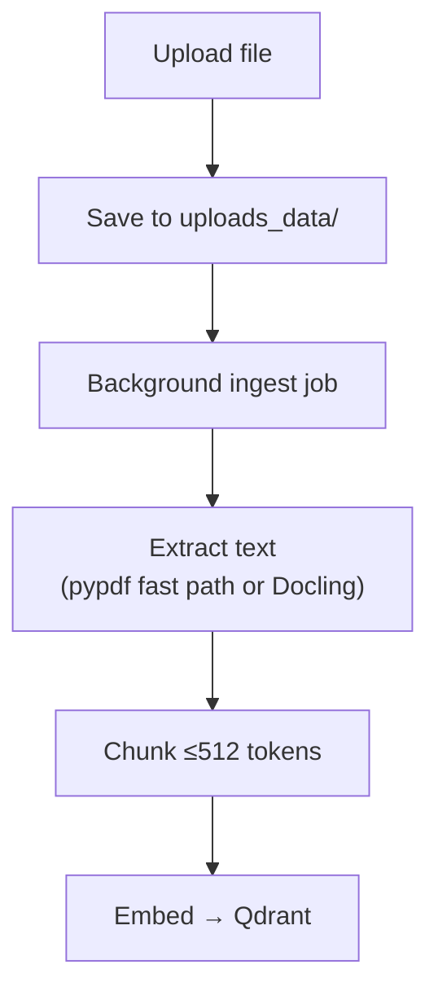

# BuildLens — User Tutorial

**BuildLens** is a self-hosted app for chatting with your documents. Upload PDFs, spreadsheets, images, and code; BuildLens indexes them locally, retrieves relevant passages, and answers your questions with citations—using **Ollama on your machine** or **cloud LLMs** you configure.

This guide walks you from zero to your first grounded answer.

---

## What you need

| Requirement | Notes |
| ----------- | ----- |
| **Docker** + **Docker Compose** | Easiest way to run the full stack |
| **~4 GB RAM** for the API container | Embeddings load on first ingest/search; models are cached after that |
| **An LLM** | [Ollama](https://ollama.com) (recommended for privacy) or an API key for OpenAI, Gemini, Anthropic, OpenRouter |

Optional: Git, to clone the repository.

---

## Step 1 — Install and start BuildLens

1. **Clone the project** (or download and unzip):

   ```bash
   git clone https://github.com/rajbhupendra588/BuildLens.git
   cd BuildLens
   ```

2. **Create your environment file:**

   ```bash
   cp .env.example .env
   ```

   For Docker, keep the defaults unless you know you need to change them. Important values:

   - `NEXT_PUBLIC_API_URL=http://localhost:8000/api/v1` — how the browser reaches the API
   - `LLM__OLLAMA_BASE_URL=http://host.docker.internal:11434` — Ollama on your Mac/Windows host from inside Docker

3. **Start everything:**

   ```bash
   docker compose up --build
   ```

   Wait until the frontend, API, Postgres, and Qdrant are up (first build can take several minutes).

4. **Open the app:**

   | URL | Purpose |
   | --- | ------- |
   | http://localhost:3000 | Chat (home) |
   | http://localhost:3000/library | Document library |
   | http://localhost:3000/settings | LLM keys, retrieval, storage |
   | http://localhost:8000/docs | API reference (developers) |

To stop: `Ctrl+C`, then `docker compose down`. Your data stays in `postgres_data/`, `qdrant_data/`, and `uploads_data/` on disk.

---

## Step 2 — Connect a language model

BuildLens does not ship a built-in model; it calls **your** LLM after retrieving text from your files.

### Option A — Ollama (local, private)

1. Install [Ollama](https://ollama.com) on your **host** machine (not inside the BuildLens containers).
2. Pull a model, for example:

   ```bash
   ollama pull llama3.2
   ```

3. Ensure Ollama is running (`ollama serve` if needed).
4. In BuildLens, open **Settings → AI Providers**, confirm the Ollama URL matches your setup (Docker default: `http://host.docker.internal:11434`), and use **Test connection**.
5. In the chat sidebar, pick **Ollama** and your model from the model dropdown.

### Option B — Cloud providers

1. Open **Settings → AI Providers**.
2. Enter and save API keys for **OpenAI**, **Gemini**, **Anthropic**, or **OpenRouter** as needed.
3. Use **Test** on each key before chatting.
4. Select that provider and model in the chat UI.

Keys saved in Settings are stored in your **local PostgreSQL** database, not sent to third parties except when you actually chat.

---

## Step 3 — Add documents to your knowledge base

The **Library** is your long-lived index: files here are chunked, embedded, and searchable across all chat sessions.

1. Go to **Library** (http://localhost:3000/library).
2. **Drag and drop** files or folders onto the drop zone, or use the file picker.
3. Watch upload progress. Indexing runs **in the background**; large or scanned PDFs can take longer (Docling/OCR).
4. When indexing finishes, the file appears in the list. You can open previews where supported and remove files you no longer need.

**Limits (defaults):**

| Limit | Default | Change via |
| ----- | ------- | ---------- |
| Max size **per file** | **20 MB** | `STORAGE__MAX_UPLOAD_BYTES` in `.env` (restart backend). If you raise it, update the matching constant in `frontend/src/lib/document-upload.ts`. |
| Max files in **Library** | **5** | `STORAGE__MAX_LIBRARY_FILES` |
| Max **session attachments** in chat | **5** | `STORAGE__MAX_SESSION_ATTACHMENTS` |

**Supported formats:**

| Format | What happens |
| ------ | -------------- |
| PDF (text) | Fast text extraction, then chunk → embed |
| PDF (scanned), images, DOCX, PPTX | Docling (heavier; first use may download models) |
| CSV, XLSX | Converted to text via pandas |
| JSON, TXT, MD, PUML, source code | Read directly, language-aware chunking |

Embeddings use **FastEmbed** (`nomic-ai/nomic-embed-text-v1.5`, 768 dimensions). Chunks are capped at **512 tokens**.

---

## Step 4 — Chat with your documents

1. Open **Chat** (http://localhost:3000).
2. **New chat** from the sidebar (sessions are saved in Postgres).
3. Ask a question about material in your **Library**, for example: *“What are the main risks in the Q3 report?”*
4. BuildLens **retrieves** similar chunks from Qdrant, **streams** the answer (SSE), and shows **sources** you can expand.

### Session-only attachments (optional)

You can attach files **to one chat** without adding them to the Library:

- Use the attachment control in the chat input.
- BuildLens can show a **quick preview** quickly while full indexing continues in the background.
- Good for one-off PDFs; the **Library** is better for documents you want in every session.

Pick provider and model in the sidebar before sending messages.

---

## Step 5 — Tune behavior in Settings

| Section | What you can do |
| ------- | ---------------- |
| **AI Providers** | Ollama URL, cloud API keys, defaults |
| **RAG Retrieval** | How many chunks to fetch (top-K), similarity threshold |
| **Storage** | View indexed file/chunk counts; **clear vector DB** or **chat history** (destructive—confirm in the dialog) |
| **Preferences** | Theme; export/import chat history |

If you change the embedding model in config, clear the vector store in **Storage** and re-index documents so dimensions stay consistent.

---

## How it works (short)



1. **Upload** → file saved under `uploads_data/`, job queued.
2. **Ingest** → extract text → chunk → embed → store in Qdrant.
3. **Question** → embed query → search Qdrant → build context → LLM stream → save message + citations.

Uploads are **async**: the API returns a job id; the UI polls until indexing completes. Only **one full ingest** runs at a time to keep memory predictable.

---

## Troubleshooting

| Problem | Things to try |
| ------- | ------------- |
| Chat says model unavailable | Ollama running on host? Correct URL in Settings? Model pulled (`ollama list`)? |
| “File too large” | Default **20 MB** per file; increase `STORAGE__MAX_UPLOAD_BYTES` and frontend limit together. |
| Library full | Remove a file or raise `STORAGE__MAX_LIBRARY_FILES`. |
| Slow first PDF/image | Docling/OCR is CPU-heavy; API container has 4 GB / 2 CPU by default in `docker-compose.yml`. |
| UI cannot reach API | `NEXT_PUBLIC_API_URL` must be reachable **from your browser** (usually `http://localhost:8000/api/v1`). |
| Empty answers, no sources | Confirm files finished indexing; try a more specific question; check **RAG Retrieval** thresholds in Settings. |

Health check: `GET http://localhost:8000/api/v1/health` (DB + Qdrant status).

---

## Local development (optional)

If you prefer running the API or UI on the host while keeping databases in Docker:

**Backend**

```bash
cd backend
uv sync
docker compose up -d qdrant postgres
# In .env: DB__HOST=localhost, QDRANT__HOST=localhost
uv run uvicorn app.main:app --reload --port 8000
```

**Frontend**

```bash
cd frontend
npm install
npm run dev
```

See [frontend/README.md](frontend/README.md) for UI-only commands.

---

## Architecture reference

<details>
<summary>Deployment and ingest diagrams (for contributors)</summary>

### Deployment



### Data on disk

| Path | Purpose |
| ---- | ------- |
| `uploads_data/` | Original uploads |
| `qdrant_data/` | Vector index |
| `postgres_data/` | Chat sessions, settings |
| Docker volume `backend_model_cache` | Embedding model cache |

### Ingest pipeline



</details>

---

## Contributing

Contributions welcome. Use conventional commits (`feat:`, `fix:`, `docs:`). Run `npm run lint` in `frontend` before opening PRs.
